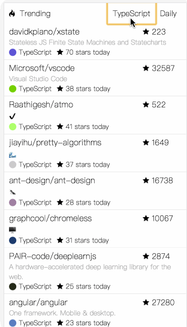

# reason-github-trending
A github trending app by ReasonML, using jaredly's [isomagic-todos](https://github.com/jaredly/isomagic-todos/) boilerplate.



```sh
opam install tls lwt lwt.unix cohttp cohttp.lwt yojson lambdasoup
```
